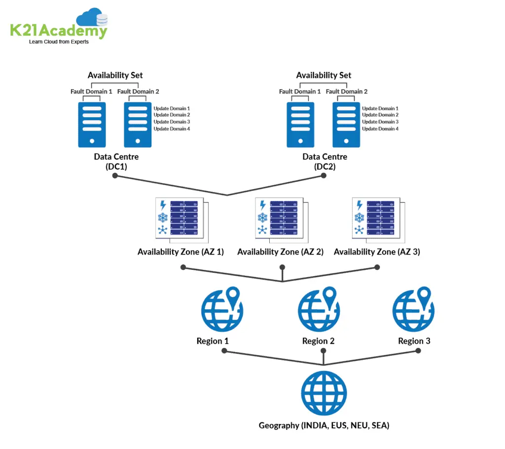

# What is Azure?
Azure is Microsoft's cloud computing platform and set of services provided. It allows organizations to build, deploy, and manage applications and services through Microsoft-managed data centers.

## Key Features of Azure:
_Scalability_ : Azure offers scalable computing resources, allowing organizations to scale up or down based on demand. This flexibility helps in managing resources efficiently and cost-effectively.

_Reliability_ : Azure provides high availability and reliability for applications and services through redundant infrastructure and built-in fault tolerance mechanisms.

_Security_: Azure offers robust security features and compliance certifications to help protect data, applications, and infrastructure from threats and vulnerabilities.

_Global Reach_: Azure operates in a global network of data centers spread across multiple regions worldwide. This global presence allows organizations to deploy applications closer to their users for better performance and compliance with data residency requirements.

_Hybrid Capabilities_: Azure supports hybrid cloud scenarios, allowing organizations to integrate on-premises infrastructure with cloud services seamlessly. This hybrid approach provides flexibility and enables organizations to leverage existing investments while adopting cloud technologies.

## What services do they offer?

_Compute_: Virtual machines, containers, serverless computing.
_Storage_: Blob storage, file storage, disk storage.
_Networking_: Virtual networks, load balancers, VPN gateways.
_Databases_: Relational databases, NoSQL databases, data warehousing.
_AI and Machine Learning_: Machine learning, cognitive services, bot services.
_Internet of Things (IoT)_: IoT hub, IoT Central, Azure Sphere.
_DevOps_: DevOps tools, continuous integration, continuous deployment.
_Security and Identity_: Azure Active Directory, Key Vault, Security Center.

## Azure regions and availability zones:

### Azure organization/structure:

Subscriptions: A subscription is a billing container that holds the resources you create and use in Azure. It defines the billing scope and access control boundaries for resources.

Resource Groups: A resource group is a logical container that holds related resources for an Azure solution. You can manage and organize resources by grouping them into resource groups based on their lifecycle, ownership, or organizational structure.

Resources: Resources are the individual services or components that you deploy and manage in Azure, such as virtual machines, databases, storage accounts, and web apps.

## How do I work with Azure?

Centrally managed, Azure provides various tools and interfaces for managing and interacting with Azure resources, including:

Azure Portal: A web-based interface for managing and monitoring Azure resources.
Azure CLI: A command-line interface for managing Azure resources from the terminal or command prompt.
Azure PowerShell: A set of cmdlets for managing Azure resources using PowerShell scripts.
Azure Management APIs: REST APIs for programmatically managing Azure resources.
Azure Mobile App: A mobile app for monitoring and managing Azure resources on the go.
Conclusion:
Azure provides a comprehensive cloud computing platform with a wide range of services and features to help organizations build, deploy, and manage applications and services effectively. Understanding the basics of Azure is essential for leveraging its capabilities to drive business success and innovation.